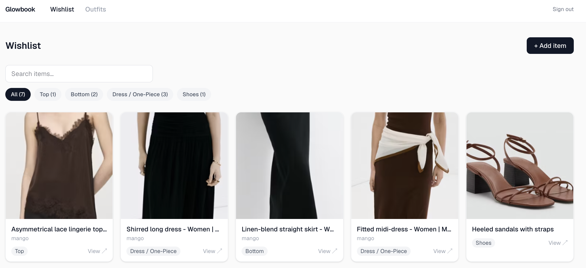
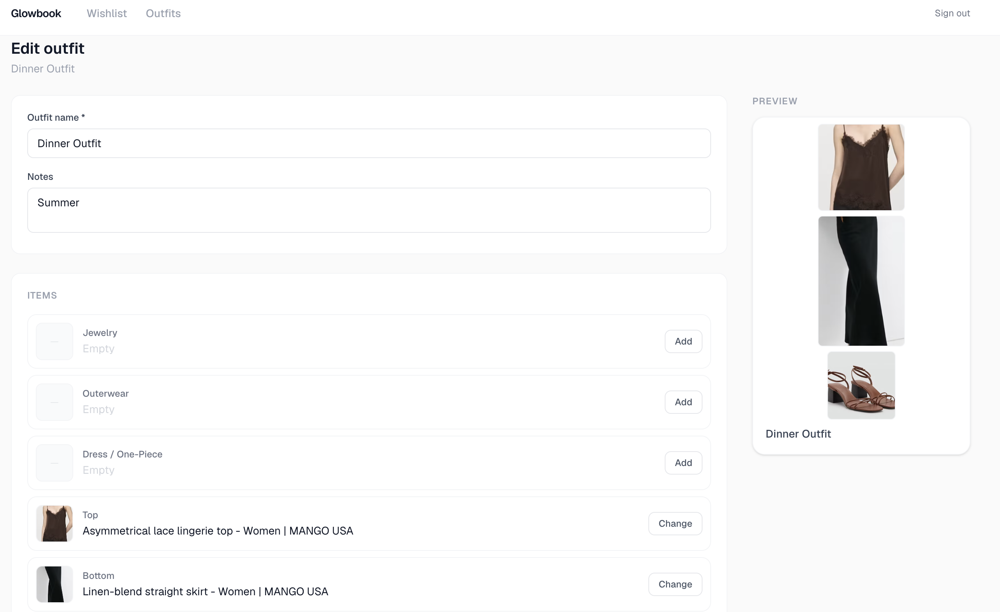
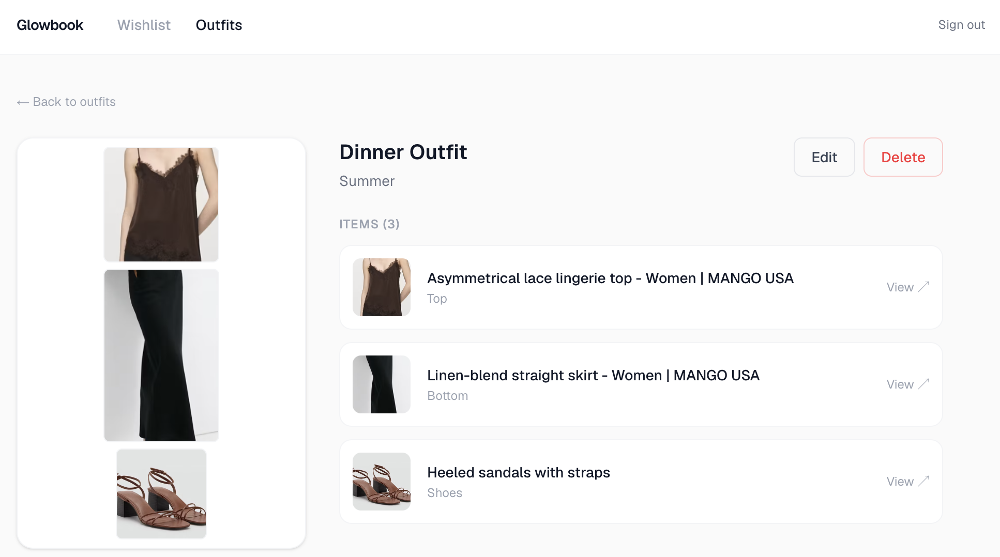

# Glowbook

[](https://github.com/taylormurrell/glowbook/actions/workflows/ci.yml)

A personal wardrobe and outfit-planning app. Save fashion wishlist items from any retailer URL, upload your own photos, and build visual outfit cards by combining items into named looks.

> **Why I built this:** I wanted a real project to learn Supabase end-to-end (auth, Postgres with row-level security, and private file storage) while building something I'd actually use. This is a solo side project, not a startup.

---

## Screenshots

**Wishlist:** save items from any retailer URL with auto-scraped images, names, and prices


**Outfit builder:** assign wishlist items to category slots with a live visual preview


**Outfit detail:** view a finished outfit card alongside the full item list


---

## Tech stack

| Layer | Technology |
|---|---|
| Framework | Next.js 16 (App Router), TypeScript |
| Styling | Tailwind CSS v4 |
| Auth | Supabase Auth (SSR, cookie-based sessions) |
| Database | Supabase Postgres with Row Level Security |
| Storage | Supabase Storage (private bucket, signed URLs) |
| Scraping | Cheerio (server-side product data extraction) |
| Validation | Zod (schema validation on every API route) |
| Testing | Vitest (unit tests for security and validation logic) |
| Hosting | Vercel (auto-deploys from `main`) |

---

## Features

- **Wishlist:** paste a retailer URL and auto-scrape the product name, brand, price, and image; manually edit any field; categorize by type (top, bottom, dress, shoes, bag, jewelry, etc.)
- **Image handling:** upload your own photo via drag-and-drop, or use the scraped retailer image
- **Outfit builder:** create named outfits by assigning wishlist items to category slots, with a live visual preview as you build
- **Outfit board:** browse all saved outfits as visual cards; click through to a detail view with the full item list

---

## What I learned building this

### Locking down the database with Row Level Security (RLS)
By default, a database trusts whoever is making the request. Row Level Security moves access control into the database itself, so user-owned rows are scoped by policy even if the app code makes a broader query.

Setting it up had two non-obvious steps:
- **Enabling RLS isn't enough on its own.** You also have to explicitly tell the API layer it's allowed to read the table at all. Without that second step, the table silently shows as unavailable, with no helpful error explaining why.
- **Every table needs its own rule, including join tables.** The `outfit_slots` table (which links outfits to items) doesn't have a user ID on it. The rule has to say "only allow access if the outfit this slot belongs to is owned by the current user," which requires one extra join in the policy logic. On a later review pass I tightened this further: writes now also check that the linked wishlist item is owned by the same user, so a slot can't reference someone else's item even if the parent outfit is yours.

### Keeping uploaded images private
The easy approach for image storage is a public bucket, where every image gets a permanent URL that anyone can visit. I used a private bucket instead, which means images are only accessible if the server explicitly authorises the request.

How it works in practice:
- The database stores a file **path** (like `user-id/1234567890.jpg`), not a URL
- Every time a page loads, the server generates a **temporary URL** for each image that expires after 1 hour and swaps it into the response before it reaches the browser
- If someone saved an old URL and tried to use it later, it would already be expired and return nothing

Scraped retailer images from product pages are just normal public URLs and don't need any of this treatment.

### Next.js: knowing when code runs on the server vs the browser
Next.js lets you mix server-rendered and browser-rendered components in the same app, which is powerful but has some sharp edges:

- Some things, like reacting to a broken image loading, can only happen in the browser. Trying to do it in a server component throws a runtime error that isn't immediately obvious to debug.
- Pages that fetch data directly from Supabase (server components) completely bypass the API routes. Any processing you want applied to every response, like swapping in those temporary image URLs, has to be done explicitly in each page rather than once in the API layer.

### Scraping product pages
When you paste a retailer URL into Glowbook, the server fetches that page and extracts the product name, price, brand, and image automatically using a library called Cheerio. It works by reading the structured metadata that most retail sites embed in their pages for SEO purposes.

One limitation: many retailer CDNs block their images from loading on other websites to protect bandwidth and branding. Scraped images sometimes won't display for this reason, so uploading your own photo is the more reliable path.

### Validating everything coming into the API (Zod)
Every API route is a potential entry point for bad data. Early on, the routes took whatever the browser sent and passed it straight to the database, which meant a malicious request could include extra fields like a forged user ID or unexpected data types.

I added a validation layer using a library called Zod. It works like a strict checklist at the door of each API route: the incoming data has to match an exact description of what's expected (right fields, right types, nothing extra). If it doesn't match, the request is rejected immediately with a clear error before it gets anywhere near the database. The database's own security rules catch anything that slips through, but this stops most bad input much earlier.

### Protecting the scrape feature from server-side attacks (SSRF)
SSRF, or Server-Side Request Forgery, is an attack where someone tricks your server into making requests on their behalf to places it shouldn't be talking to.

In this case, the scrape feature takes a URL from the user and fetches it from the server. Without any checks, someone could submit something like `http://169.254.169.254`, an internal AWS address that returns server credentials, and the server would happily fetch it.

The guard reduces the main SSRF risks in a few layers:
- **Reject non-web URLs immediately.** Only `http://` and `https://` are allowed.
- **Resolve the domain to its real IP address before fetching.** A domain that looks innocent might actually point to an internal address. Checking the URL string isn't enough; you have to check where it actually resolves to.
- **Re-validate on every redirect.** A URL can redirect to a different URL, so each hop is checked independently.
- **Only parse HTML, and cap how much gets read.** The response has to be an HTML content type, and the body is read up to a 2 MB limit so a huge or hostile page can't exhaust server memory.

It reduces these risks rather than eliminating them. One known limitation is DNS rebinding, where a domain resolves to a safe address at check time but switches to an internal one by the time the actual request is made. That can't be fully prevented at the app layer and would require network-level controls. I also haven't added rate limiting. Both are noted under Known limitations as accepted tradeoffs for a personal demo.

### Why there are two schema files
The database setup lives in two places, and that's deliberate.

`supabase/schema.sql` came first. It's a single file you paste into the Supabase web SQL editor to build the whole database in one go, and it's how the live database was originally set up. The `supabase/migrations/` folder came later. It builds the same schema, restructured into the format Supabase's command-line tool runs automatically with `npx supabase db push`.

So why add migrations if `schema.sql` already worked? A single schema file describes what the database should look like right now, but it keeps no history. The moment the schema needs to change, you're back to hand-editing the file and remembering to re-run it everywhere. Migrations are timestamped, versioned files that a tool applies in order, which turns schema changes into something tracked and repeatable rather than a manual copy-paste.

I kept both because they serve different moments:

| File | Best for | Trade-off |
|---|---|---|
| `supabase/schema.sql` | Quickly pasting into the Supabase web editor with no CLI setup | Has to be kept in sync by hand |
| `supabase/migrations/` | Repeatable, versioned setup via `npx supabase db push` | Needs the Supabase CLI installed and linked |

The migrations are the source of truth. `schema.sql` is a snapshot of the end state those migrations produce, kept only as a convenience for pasting into the web editor; its header says as much. When a migration changes the schema, the snapshot gets updated to match, so the two describe the same final database rather than drifting apart.

---

## Running locally

### Prerequisites
- Node.js 20+ (required by the test runner)
- A [Supabase](https://supabase.com) account (free tier is enough)

### 1. Clone and install
```bash
git clone https://github.com/taylormurrell/glowbook.git
cd glowbook
npm install
```

### 2. Create a Supabase project
1. Create a new project at [supabase.com](https://supabase.com)
2. In **Project Settings → API**, copy your **Project URL** and **anon public key**
3. Copy `.env.example` to `.env.local` and fill in your values:
```bash
cp .env.example .env.local
```
```
NEXT_PUBLIC_SUPABASE_URL=https://your-project-id.supabase.co
NEXT_PUBLIC_SUPABASE_ANON_KEY=your-anon-key
```

### 3. Run the database schema
The schema is managed as a versioned migration in `supabase/migrations/`. To apply it to a fresh database, run:
```bash
npx supabase link   # connect the CLI to your Supabase project
npx supabase db push
```
This creates the tables, enables RLS, adds policies, and grants Data API access. The migrations are the source of truth. If you prefer not to use the CLI, you can paste `supabase/schema.sql` directly into the Supabase SQL editor instead; it's a convenience snapshot that's updated whenever the migrations change. (See [Why there are two schema files](#why-there-are-two-schema-files) for the full reasoning.)

### 4. Create the storage bucket
In Supabase **Storage**, create a bucket named `item-images` with **Public bucket turned off**.

### 5. Start the dev server
```bash
npm run dev
```
Open [http://localhost:3000](http://localhost:3000), create an account, and start adding items.

---

## Project structure

```
src/
  app/
    (app)/              # Authenticated routes (dashboard, wishlist, outfits, outfit-builder)
    api/                # Route handlers (items, outfits, scrape, upload)
    login/              # Public auth page
  components/           # Shared UI components
  lib/
    __tests__/          # Unit tests (ssrf-guard, schemas)
    supabase/           # Server and client Supabase instances
    constants.ts        # Category and slot enums
    resolve-images.ts   # Signed URL resolution for uploaded images
    schemas.ts          # Zod schemas for all API route inputs
    ssrf-guard.ts       # URL validation to prevent SSRF on the scrape endpoint
    types.ts            # Shared TypeScript types
  proxy.ts              # Auth middleware: protects routes and refreshes the session
supabase/
  migrations/           # Versioned schema migrations (source of truth)
  schema.sql            # Full database schema with RLS policies and grants
```

---

## What I'd build next

- **Tagging and filtering:** tag outfits by occasion, season, or mood; filter the wishlist by multiple categories at once
- **Outfit sharing:** generate a public shareable link for a single outfit (opt-in, not default)
- **Price tracking:** get an alert when a wishlist item drops in price
- **Mobile polish:** responsive styles are in place but the app targets desktop; a proper mobile pass would verify layouts and tap targets on small screens
- **Beauty section:** the app is named Glowbook and scoped for eventual expansion into skincare and makeup routines

---

## Security notes

A quick checklist of what's enforced (the reasoning behind each is in [What I learned](#what-i-learned-building-this) above):

- **Row Level Security** is enabled on every user-owned table, with policies that scope access to the authenticated owner (`auth.uid() = user_id`). Join-table writes additionally verify that linked rows are owned by the same user
- **Private image storage:** uploaded images sit in a private bucket and are only reachable via short-lived signed URLs generated server-side
- **No service role key** in browser code; the app uses only the public anon key
- **`.env.local` is git-ignored**
- **SSRF protection** on the scrape endpoint: user-supplied URLs are validated before every fetch (and every redirect hop). Non-http(s) schemes are rejected, the hostname is resolved to its IP, and any private, loopback, or link-local address is blocked across IPv4, IPv6, and IPv4-mapped IPv6. The response is restricted to HTML and capped at 2 MB. Residual risk: DNS rebinding can't be fully closed at the app layer and is accepted for a personal app.

---

## Known limitations

This is a personal app, and I've been deliberate about what I did and didn't harden. Things a production version would need that this doesn't have:

- **No rate limiting** on any endpoint, including the scraper.
- **Residual DNS rebinding risk** on the scrape endpoint, as noted above. Fully closing it needs network-level egress controls, not application code.
- **Upload validation checks MIME type and size, not file contents.** The MIME type comes from the browser and isn't independently verified (e.g. by inspecting magic bytes), so it shouldn't be treated as strong file-type validation. Files are stored under a random UUID name with an extension derived from the declared type.
- **No API route integration tests yet.** The unit tests cover validation and the SSRF guard; testing the routes end-to-end needs a live test database, which I haven't set up.
- **The SSRF guard blocks the common private ranges, not every special-use range.** It covers RFC 1918, loopback, and link-local; ranges like carrier-grade NAT (`100.64/8`) and documentation/test networks are out of scope for this demo. The guard targets internal-network access, not every non-public address.
- **Outfit updates are not atomic.** Editing an outfit deletes its existing slots and inserts the new ones as separate statements rather than in a transaction. Both failure paths are now checked and surfaced as errors, but if the insert failed after the delete, the outfit could be left with no slots. A production version would wrap this in a Postgres function/RPC transaction.

---

## Tests

Unit tests cover the two layers most likely to have subtle bugs: the SSRF guard and the API input schemas.

```bash
npm test
```

| File | What it covers |
|---|---|
| `src/lib/__tests__/ssrf-guard.test.ts` | `isPrivateAddress` (IPv4, IPv6, and IPv4-mapped IPv6 ranges), scheme rejection, private-IP-in-URL rejection, malformed URLs |
| `src/lib/__tests__/schemas.test.ts` | Every zod schema: required fields, enum validation, partial updates, slot UUID checks, file type/size rules |

API route integration tests (routes that call Supabase) are not yet written; see [Known limitations](#known-limitations). When added, they would cover the things unit tests can't reach: RLS ownership boundaries (a user can't read or write another user's rows), signed-image resolution in API responses, and outfit-slot replacement behavior on update.

---

## License

MIT
